## install
```bash
npm i e-color
```

## usage
```ts
import { Rgb } from "e-color"
const c1 = new Rgb(COLORS.White)
expect(c1.toHex()).toEqual("FFFFFF")
expect(new Rgb("FFFFFF").toBgr().toHex()).toEqual("FFFFFF")
```

## bench
update bench
```bash
pnpm bench --run | ansi2 > ./assets/bench.svg
```

<div align="center">
	<a href="https://github.com/ahaoboy/e-color">
		
	</a>
</div>